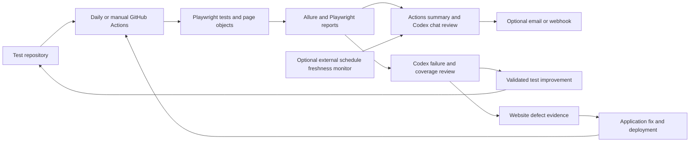

# La Poire test ecosystem

The ecosystem combines cloud execution, durable evidence, result delivery, and a maintenance loop. The JavaScript POM/Playwright suite is published to [The-Whale-1/LaPoire-Website](https://github.com/The-Whale-1/LaPoire-Website) on `main`; its [first cloud regression run](https://github.com/The-Whale-1/LaPoire-Website/actions/runs/37839846812) completed and its reports were verified. Daily and manual workflow definitions are accepted by GitHub. Codex reviews evidence, improves the page objects and case coverage, and validates proposed changes. Application bugs stay visible until the website is repaired.

## Execution loop

The full enabled suite in this maintenance revision is scheduled for 06:07 Cairo time, effective after merge to `main`. This moves execution seven minutes later than the previous 06:00 schedule; the next intended scheduled event on 2026-10-10 remains unverified. Every case uses page objects so locator changes live in one place. Independent browser contexts separate cookies and guest carts. Serial execution prevents concurrent mutations of a shared authenticated account. The test runner returns a nonzero exit code for real failures; later report generation does not turn a failed test run green.

Schedule audit on 2026-10-09 at 11:57 Cairo found zero `schedule` events: the expected 06:00 Cairo run under the previous cron was missing. Public API metadata reported the workflow `active`, with the workflow on default branch `main` and the visible scheduling prerequisites satisfied; the repository was recently active, not a fork, and not archived. The cause is unconfirmed. The latest completed cloud run was about 12 hours old, below the 30-hour freshness limit. Repository Actions administration settings were unavailable through public API reads (HTTP 401), and manual dispatch could not be verified in the inspected signed-out browser session. [GitHub documents possible schedule delays or dropped events at hourly peaks](https://docs.github.com/en/actions/reference/workflows-and-actions/events-that-trigger-workflows#schedule); moving execution seven minutes later is preventive, and does not establish or repair a confirmed root cause.

Initial cloud execution on 2026-10-08 produced **37 passed, 1 failed, 10 skipped, 0 flaky, and 0 healed** out of 48 cases in 202.204 seconds. Chocolates category navigation reached `/list/undefined` and remained a failed test. The 10 skipped cases were outside the enabled public scope. Report generation, summary generation, and artifact upload still succeeded; the downloaded [artifact](https://github.com/The-Whale-1/LaPoire-Website/actions/runs/37839846812/artifacts/11576543769) contained both HTML reports and 48 Allure results and expires on 2026-10-22. The separate [offline checks](https://github.com/The-Whale-1/LaPoire-Website/actions/runs/37839847013) passed 18 unit checks and discovered 48 cases.

Artifacts contain per-run Allure results and HTML, a Playwright HTML report, machine-readable results, a Markdown summary, and permitted failure evidence. GitHub keeps the report artifact for 14 days. The initial delivery is GitHub Actions plus a Codex chat follow-up. SMTP and generic webhook delivery are optional extensions. The selected repository is public; its Actions artifacts are visible to signed-in users with repository read access. The initial scope is public browsing/cart journeys, and its artifacts should be treated as public.

The initial result was reported in Actions and this Codex chat. The notification step completed with no optional destination configured, so email/webhook delivery has not been verified. The first artifact excludes a raw `test-results` directory; generated reports retain the redacted diagnostic attachments needed to review this run.

The separate `framework-checks.yml` workflow validates helpers and Playwright test discovery offline on pull requests and pushes. It receives no staging account or notification secrets. Pushes to `main` also trigger the live regression workflow; live tests use only the reviewed default branch. Test code is not automatically deployed or rewritten by the test runner's scheduled workflow.

After [PR #1](https://github.com/The-Whale-1/LaPoire-Website/pull/1) patched Allure's transitive Handlebars dependency and isolated discovery from report generation, the [final full cloud regression](https://github.com/The-Whale-1/LaPoire-Website/actions/runs/37841095390) again produced **37 passed, 1 failed, 10 skipped, 0 flaky, and 0 healed** in 194.5 seconds. Its install reported zero vulnerabilities, and the downloaded [latest artifact](https://github.com/The-Whale-1/LaPoire-Website/actions/runs/37841095390/artifacts/11577338407) verified both HTML reports and matching 48-result summaries. The original failed run remains available; Chocolates navigation has not been hidden or healed.

## Locator healing loop

Self-healing is limited to reviewed alternative locators for the same intended element. The framework attempts its primary locator first, then may use a declared alternative after confirming that exactly one visible element matches. A fallback use must be recorded so Codex can inspect why the primary locator stopped working and, when appropriate, update the page object permanently.

Self-healing must not change expected prices, remove assertions, click an arbitrary similar element, bypass a login error, or replace an application failure with a pass. New fallback candidates require evidence that they identify the same control and preserve the original assertion. An ambiguous candidate or exhausted alternatives fails the test. `SELF_HEALING_STRICT=true` makes any fallback a failure for teams that need selector drift to block a run.

Automatic fallback is not an unattended AI browsing agent. It does not grant an LLM permission to invent selectors and mutate tests while they are running. This keeps execution repeatable and preserves defects for review.

## Codex maintenance loop

The Codex heartbeat `la-poire-daily-quality-review` is ACTIVE at a configured 09:00 Cairo daily in this chat. Its first review arrived on 2026-10-09 at 08:52:09 UTC (11:52 Cairo); delivery precisely at the configured time has not been verified. It owns review of failures, locator drift, missing runs, and meaningful coverage improvements within the authorized public browsing/cart scope. The computer and Codex app must be running, with repository/tool access available, for this desktop follow-up to execute. GitHub's cloud test runner continues independently of it.

For each meaningful new result, Codex should:

1. Inspect the latest run summary and failed-case evidence. Distinguish website behavior, locator drift, missing account/product fixtures, and CI/browser infrastructure failures.
2. Reproduce a failure with the smallest relevant case when staging and the account are available. Preserve the first failure and any retry results; do not discard failed evidence after a passing rerun.
3. Repair test defects in page objects/helpers, add a regression test for the repaired behavior where it adds real value, and run the relevant checks. Reproducible website defects remain failing cases with a clear reproduction and expected/actual behavior.
4. Add cases for observed new functionality and uncovered risk. Each new case must have an explicit user journey, setup, observable assertion, and cleanup. Separate proposed specifications from cases that actually run.
5. Validate improvements offline, then against staging as appropriate. Publish a reviewable source change through the established repository process. Do not weaken assertions or silently disable failing cases to make a report green.
6. Notify the user when a new defect, failure cluster, healing event, meaningful coverage improvement, stale schedule, completed change, or required user action appears. Stay quiet about unchanged states between the requested daily result reports.

The recurring reviewer should check that the most recent completed cloud run is no older than 30 hours, that the notification step succeeded when configured, and that report artifacts exist. An independent external schedule monitor is preferable for stronger assurance because it can detect failures of both GitHub scheduling and the local Codex host. No such external monitor is active merely because this document describes it.

## Coverage and fixture ownership

Coverage is measured by executed assertions, not by a large test count. Use `npm run test:list` to enumerate implemented JavaScript cases and the run summary to identify passed, failed, and skipped scope. Existing Python coverage is separate and must not be counted as JavaScript cloud coverage unless its runner is deliberately added.

Within the initial scope, prioritize public product discovery, categories/search, product details, cart arithmetic and persistence, delivery location, language, and login form reachability. Authenticated account and checkout-review coverage require explicit later opt-in and staging fixtures. Desktop Chromium is the initial baseline; optional Firefox/WebKit execution needs separate verification. The current page objects target desktop layouts. Mobile coverage requires dedicated locators and responsive journeys before a mobile project is enabled; real devices additionally require a device service or dedicated hardware.

Authenticated flows need a dedicated staging account, valid saved addresses, and stable in-stock fixture products. Changes to the site's catalog or delivery areas may require fixture updates. Invalid fixtures should produce diagnostics; they should not be treated as proof of a website defect or automatically replaced by arbitrary data.

Order confirmation, payment capture, registration, password reset, saved profile/address changes, complaint submissions, and custom cake requests need explicit test-fixture and cleanup arrangements before automation submits them. Existing checkout review cases stop before placing an order. New high-impact journeys should first use a payment sandbox and disposable staging data.

## Result interpretation

| Result | Meaning | Maintenance action |
| --- | --- | --- |
| Passed | The executed assertion matched expected behavior in this run | Preserve coverage; inspect recurring slowdowns or healing evidence |
| Failed: website | A covered behavior reproducibly disagreed with the requirement | Keep failure visible; provide evidence for an application fix |
| Failed: harness | A selector, assertion implementation, or fixture assumption is wrong | Repair the test and validate the original requirement |
| Failed: infrastructure | Dependencies, runner, browser, network, or report delivery failed | Restore the affected service; rerun the intended scope |
| Skipped | A case did not execute, such as authentication disabled | Report the missing scope and configure it when required |
| Healed | A reviewed alternative locator was used | Inspect selector drift and update the POM when justified |
| No recent run | The schedule did not complete within the freshness window | Alert and inspect scheduler, Actions limits, and repository state |

Tests provide sampled evidence for covered staging journeys. A daily passing suite cannot guarantee that every website feature works at every moment. Stronger availability assurance combines frequent read-only smoke checks, production monitoring, error telemetry, release checks, and an application team able to fix and deploy defects. This framework does not claim access to or control over those application systems.

Cloud activation and report delivery instructions are in [CLOUD_SETUP.md](CLOUD_SETUP.md).
